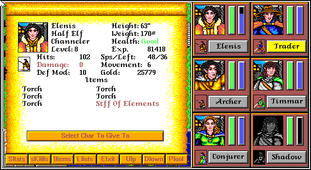
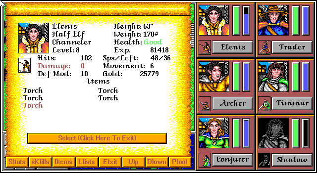
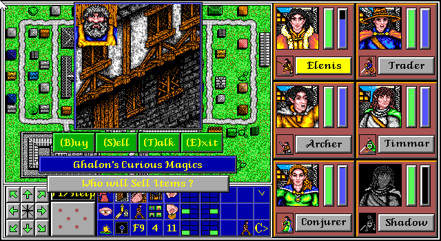
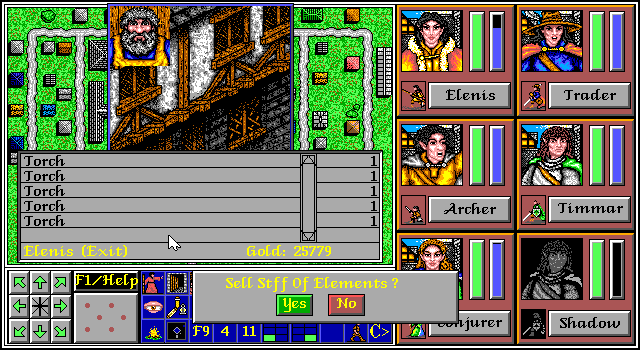
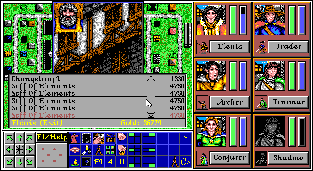

# Infinite Gold / Item Duplication

**Discovered by: Gynvael Coldwind / Claude Opus¹** in Aug'26

¹ As part of the bit-perfect recompilation project and further Claude Code reconstructed code analysis (yes, AI found this one).

**TL;DR: Shop selling interface allows selecting the 6th item on the list with the MOUSE, even if the character has less than 6 items. This allows selling a "freed" item getting free money. You can buy it back later, which is effectively item duplication.**

## Infinite Gold

**Step 1**: Make sure a character (ideally one with high trading skills or cast `Silver Tongue` with the bard) has 5 unnecessary items (you will lose them) and one expensive sellable one **on 6th position**.

**Step 2**: Give away the expensive item so that you have only 5 unnecessary items left.

**Step 3**: Go to a shop which can buy the expensive item and open the Sell window.

**Step 4**: Click with the mouse on the 6th position and sell the item. You can do this 5 times. Your unnecessary items will disappear - one per sale.

## Item Duplication

Follow the steps in the Infinite Gold section. Then just buy the item(s) back 🤷.

