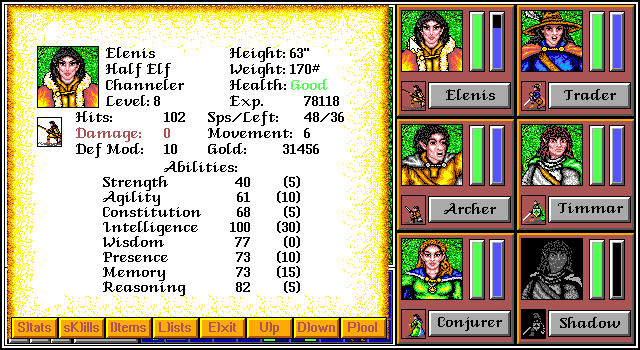
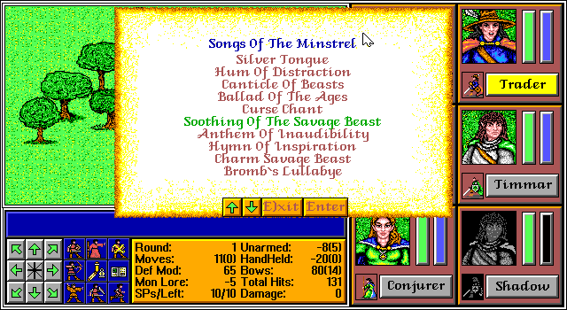
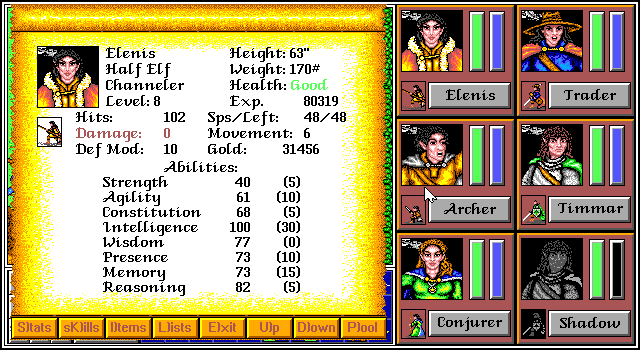

# Infinite XP

**Discovered by: Gynvael Coldwind / Claude Opus¹** in Aug'26

¹ As part of the bit-perfect recompilation project and further Claude Code reconstructed code analysis (yes, AI found this one).

**TL;DR: Casting "Soothing the Savagye Beastye" — a run-away spell - still grants you XP for the fight as if you'd won.**

Nothing more to add there really. Just start a fight with some high-level monster(s) and cast the spell with your bard. Repeat until you get as much XP as you need.

## Example with the Marsh Monster

Note: There might be higher XP fights in the game, but the Marsh Monster is easily reachable early on.

Pre-fight XP: 78118

Starting the fight and casting the spell:

Post-fight XP: 79232

XP after one more round of this: 80319

