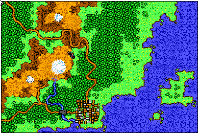

# Initial Beacon/Teleport

**Discovered by: BillBull** (not sure if there was prior art, but that's how I've learnt about it)

During livestreaming of Aethra playthrough BillBull decided to test if he can cast Teleport spell without ever setting a beacon (i.e. casting Beacon spell). He figured, that if it's not set, maybe it's near starter town by default. This turned out to be spot on.

What's more surprising about this, is that **Teleport can be cast even when Beacon is technically not active** (i.e. it's not shown in the UI).

Default location is the following (note: I'm not fully sure this is correct //gynvael):

```
World map sector                     : 4
World map sub-sector x-coord         : 3
World map sub-sector y-coord         : 2
Party x-coord on World map sub-sector: 2
Party y-coord on World map sub-sector: 2
```

