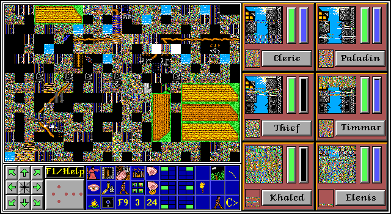
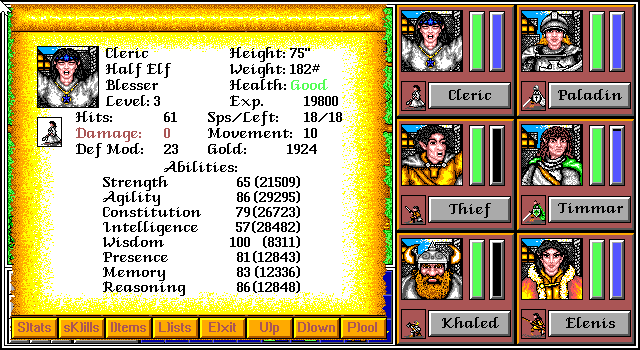

# Item Use-After-Free

**Discovered by: Gynvael Coldwind**

**Note:** This technically is a pretty versatile bug with several exploitation approaches. A better overall name might be something like "zero-item-list bug family", but since it was discovered as an item use-after-free, the name was kept.

**In short:** Non-inventory item lists (e.g. Use an Item under `I`) have a bug that an empty list fully unlocks the list selection cursor and permits one to pick items which are "not there", including items which are in memory outside of the inventory slots. There are several ways to abuse this. And you can also crash the game with this if not careful (possibility of ACE is still being investigated).

## Item Use-After-Free (Limited Item Duplication)

Simplest way to exploit this glitch:

1. Make sure 1 character has an empty inventory.
2. Give that character an item that can be used multiple times (e.g. a Green Potion which has 3 uses).
3. Remove that item from their inventory (e.g. give it back).
4. Press `I` to Use an Item. You can now pick the item that you gave away and freely move the selection cursor around.

A more efficient way is to give the character e.g. 10 Torches (or whatever) and 1 Green Potion, and then give away first the Torches, and then the Green Potion. This basically fills the inventory slots with "removed" Green Potions.

**Warning**: DO NOT use up an item! This will cause the character to have -1 (255) items in the inventory and it's a really volatile state - see also the Negative Inventory described variant below.

**Important**: Ignore the names of the items shown on the list - they are taken from whatever was shown previously on the list (e.g. if you looked at another character's items in the meantime). Regardless of the item name, the item that will actually be used is the one that occupied said inventory slot previously for the selected character.

## Negative Inventory and Stats Overwrite

If you perform Item Use-After-Free and use up the item, the game will attempt to remove that non-existant item. The result of this is having -1 (255) items in the inventory. This is a very volatile state and some actions will make the game crash.

On the flip side, if you tread carefully and **give the affected character another item, they will go back to having 0 items**. What happens to the item you gave the character? **It overwrites part of this character's statistics**:

Please note that it's not yet clear if this is useful and this is still being investigated.

