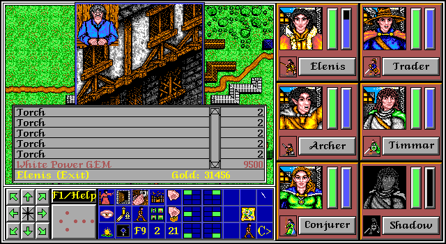

# White GEM Shopping

**Discovered by: Gynvael Coldwind / Claude Opus¹** in Aug'26

¹ As part of the bit-perfect recompilation project and further Claude Code reconstructed code analysis (yes, AI found this one).

**THIS GLITCH IS STILL BEING RESEARCHED**

**TL;DR: Shops populate their displayed items list starting at the top of their inventory table and going until they reach the first item with 0 pieces available. But there are 3 shops that have another item later down the table with has a non-zero quantity, and it's the `White power GEM` each time! To be able to buy it, you have to sell 4 or 5 other items (e.g. `Torch`) to the store, to overwrite the inventory table entries with something that has 1 piece available and make the GEM show itself on the list.**

You can think about the shop's inventory table like this:

```
ITEM        QTY
Sword       1  <-- shown
Shield      1  <-- shown
Axe         0  <-- stop
Bow         0
GEM         1  <-- not shown
Sling       0
```

The game shop's interface will go from the top of the shop's inventory table and display items until it hits the first item with quantity 0. In the example above, the `Sword` and `Shield` would be displayed, but nothing more.

If you sell for example 2 torches one-by-one to the store, the table changes, with the "sold out" items being overwritten in order:

```
ITEM        QTY
Sword       1  <-- shown
Shield      1  <-- shown
Torch       1  <-- overwritten/shown
Torch       1  <-- overwritten/shown
GEM         1  <-- shown
Sling       0  <-- stop
```

Now the algorithm will go down the list and it will show the `GEM` as well, stopping only on the `Sling`.

**Important**: We know of only 3 stores which actually have any items with non-zero quantity later down in their inventory table (and in all cases that's 1 `White power GEM`):

  * Brogar's Choice Goods (Stormhaven), requires selling 5 items (confirmed).
  * Balar's Common Goods (Drensea), requires selling 4 items (TO BE CONFIRMED).
  * Karl's General Store (Barkol), requires selling 5 items (confirmed).

To exploit this, you have to get 4 or 5 torches (or whatever other item) and then sell them to the store. Once you do that, the `GEM` will show up in the interface.

Note that the "4 or 5" depends on the store's inventory state. If you have sold a lot of stuff to this store before, you might already have access to the `GEM`. If you bought a lot of stuff from the store before, you might have to sell more items to reach the `GEM`. But for a new game, the numbers are as above.



From a technical perspective this looks like the shop's data files weren't cleared by the editor after the shop's inventory was reset (when the game was made). This is in line with what we saw in a lot of other files with "garbage data" being left. Lucky for us :)
